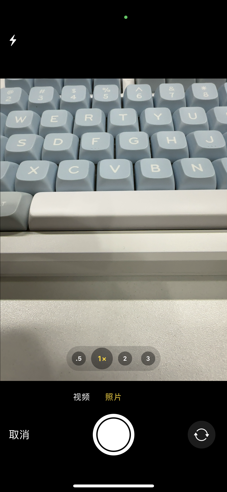
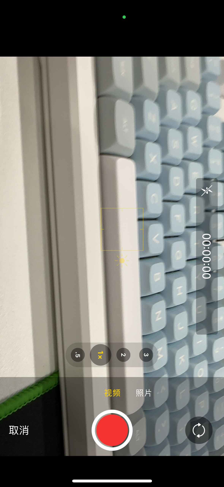
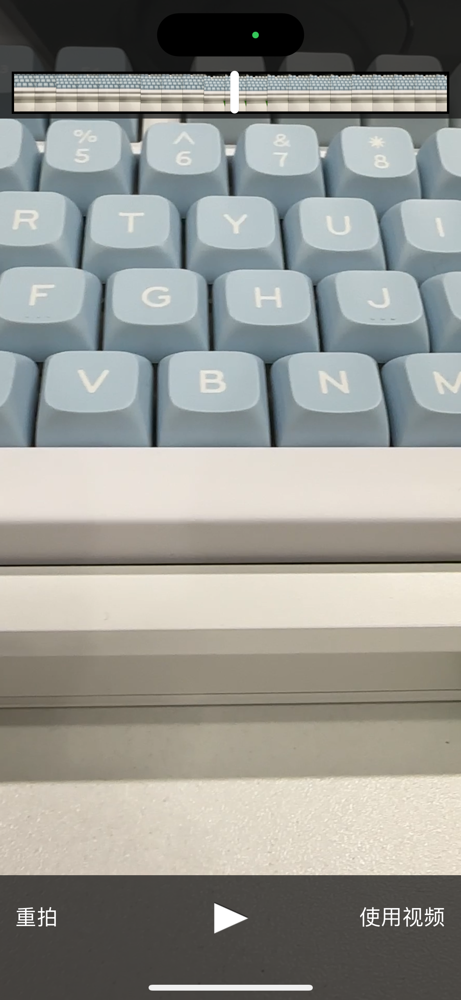
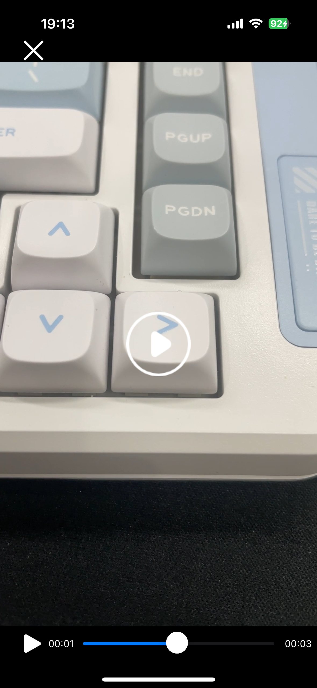

# iOS原生调用摄像头

## 使用背景

因为SFE项目需要实现拍摄图片/视频进行沟通交流，使用Qt的Camera组件会在iOS上会出现拍摄旋转问题。

其原因是由于iOS拍摄之后所有的图片旋转orientation都是Right Top，探究了qt底层代码，Qt底层并没有对iOS拍摄的图片有进行旋转。... 做了各种分析实验之后决定使用iOS原生进行开发。

## 方案调研：

1、使用UIImagePickerController 

2、使用AVFundation

区别：简单来说UIImagePickerController更简单但是提供的更少的定制化，AVFoundation更加底层可以实现完全的定制化摄像

## 使用Qt调用原生iOS摄像头

## 可能的问题

- 内存释放

  无论使没使用ARC机制都需要充分理解创建的对象的生命周期，做到自己申请的自己释放，防止出现内存泄漏的情况

- 视频格式转换卡顿，第一次启动摄像头卡顿
  
    原因：Xcode调试的时候调试工具会对应用程序进行监听和调试会增加额外开销，要是涉及硬件资源的操作那就会更慢了，所以之前都是第一次部署的时候发现卡顿，但是之后就不卡顿了。(在正式上线的时候不存在这个问题)

## 实现效果

<!--  -->

<!-- ---  -->
<!--  -->

<!-- ---  -->
<!--  -->

<!-- ---  -->
<!--  -->

<!-- --- 
 -->
