# Android发布打包

### 确认是否为最新代码
  - 切换master分支`git pull`拉取最新代码
  - 查看app.pro文件版本号是否正确
  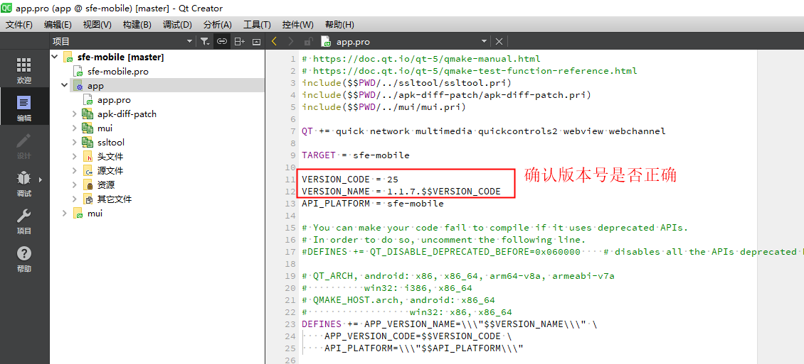

### 设置正确的Qt构建步骤和构建安卓APK
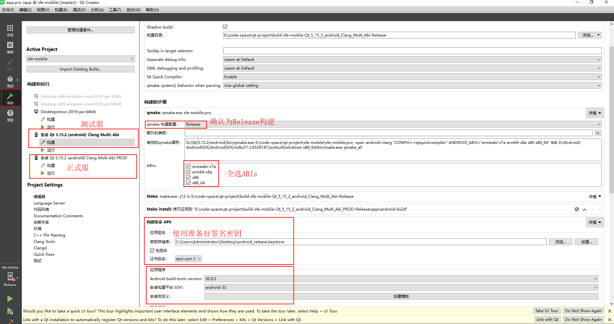
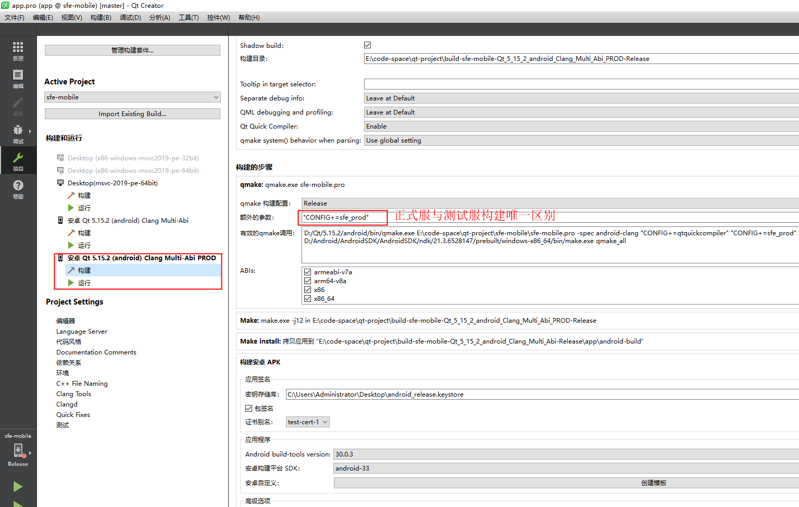
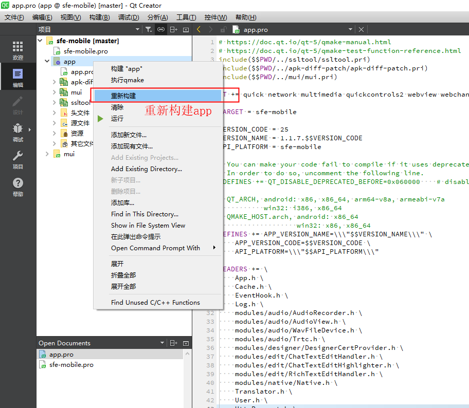

### 重命名构建的apk文件
 - apk存放位置: 
`build目录下\app\android-build\build\outputs\apk\release`
 - apk命名规则: 
sfe-版本号全称，例如版本号为1.1.7.25则apk名称为:`sfe-1.1.7.25.apk`
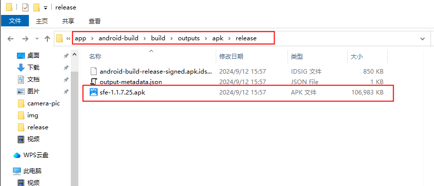

### 上传apk(测试版)至oss
 - oss测试服地址: 
 `oss://eggrj-chengd2/dev/版本号/`
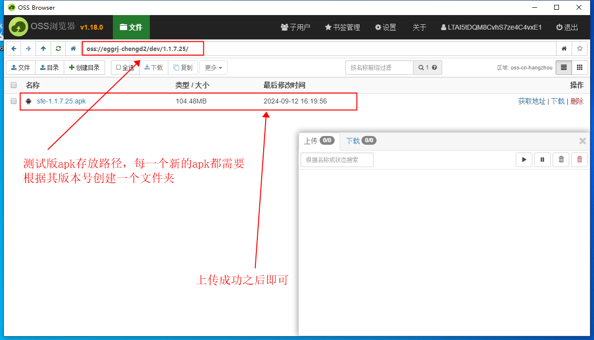
 - oss正式服地址:
 `oss://eggrj-chengd2/版本号/`
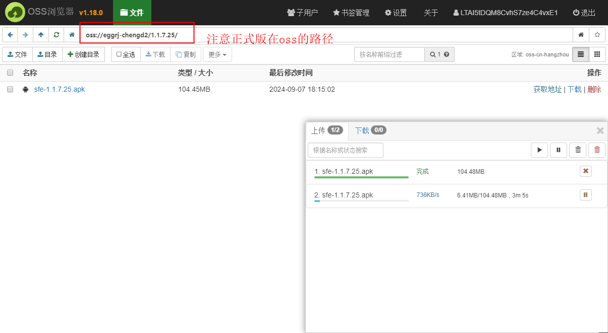
 - [制作apk二维码](https://cli.im/)

    输入正确的apk路径生成下载二维码:

        测试版：https://oss-chengdu2.eggrj.com/dev/1.1.7.25/sfe-1.1.7.25.apk

        正式版：https://oss-chengdu2.eggrj.com/1.1.7.25/sfe-1.1.7.25.apk

### 出包流程
 - 首先出测试服的包
 - 上传oss之后出二维码
 - 自扫二维码自测自己的功能
 - 无误之后提交测试(等待的时候可以同步出正式服的包)
 - 正式服包上传oss出二维码
 - 自测之后提交测试
 - 验证在线升级(白名单、非白名单) 更新latest包

### 自测更新
 测试步骤：

 - 白名单情况下：

   -  低版本 ---->  当前版本 

   -  当前版本----> 下一个版本 

   -  latest版本更新 

 - 非白名单：

   - 低版本 ---->  当前版本 
  ---

添加白名单：
在oss的update.json文件添加白名单
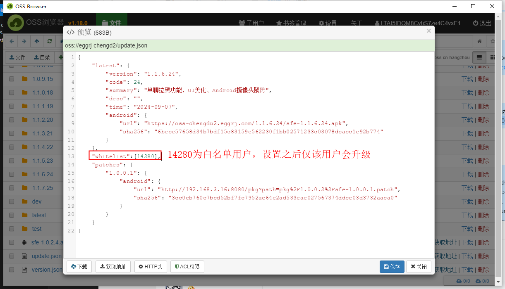

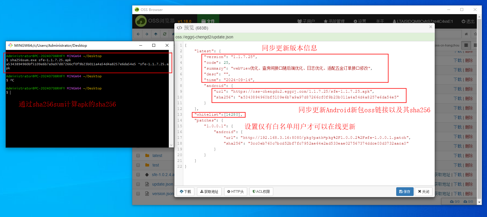
登录对应白名单账户会自动弹出更新，测试从低版本在线更新为高版本(更新完毕去app内"我的"页面查看"应用信息"检查版本号)

发布下一个版本的包，并更新update.json文件夹

验证从当前版本升级到下一个版本是否正常(更新完毕去app内"我的"页面查看"应用信息"检查版本号)
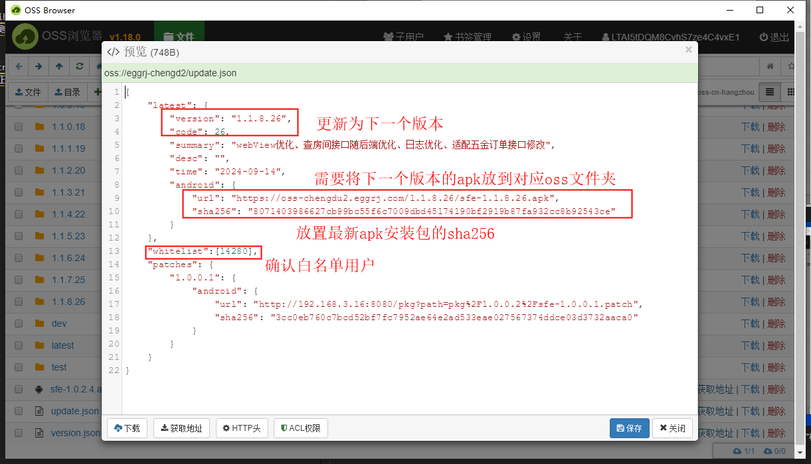

更新latest包，扫描latest二维码下载(安装后去app内"我的"页面查看"应用信息"检查版本号)
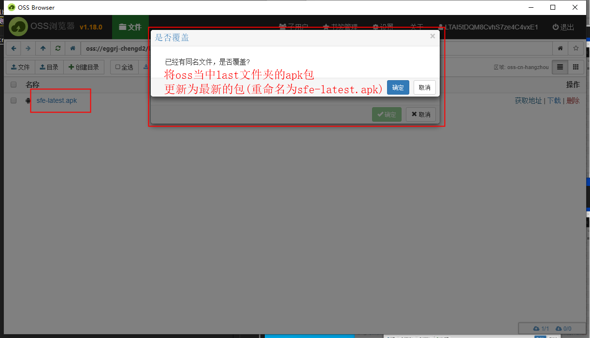

打开白名单检测更新（登录任意正式服账号即可安装验证）
