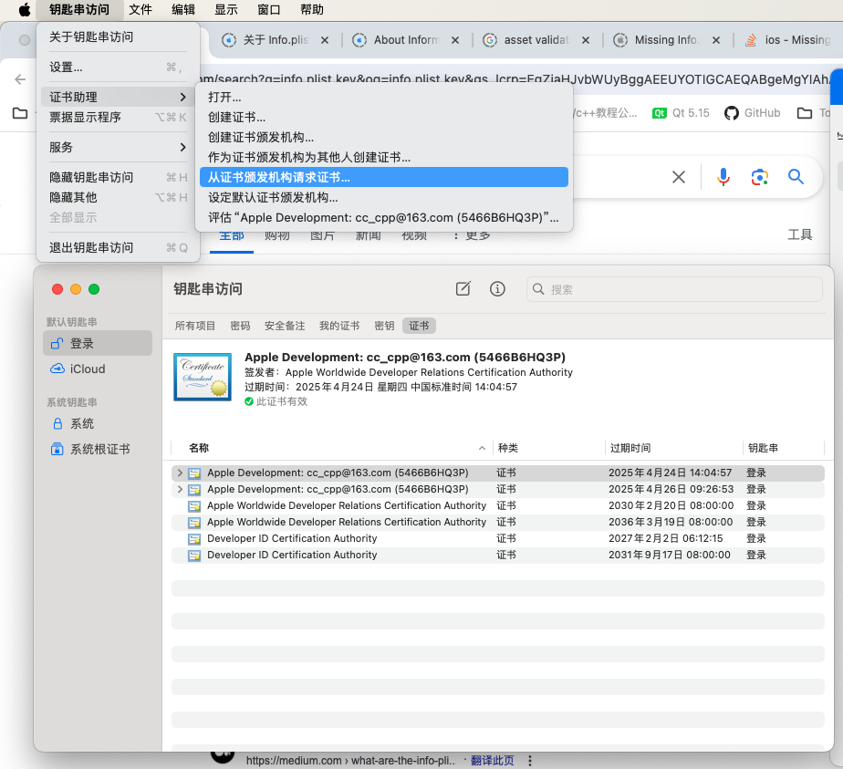
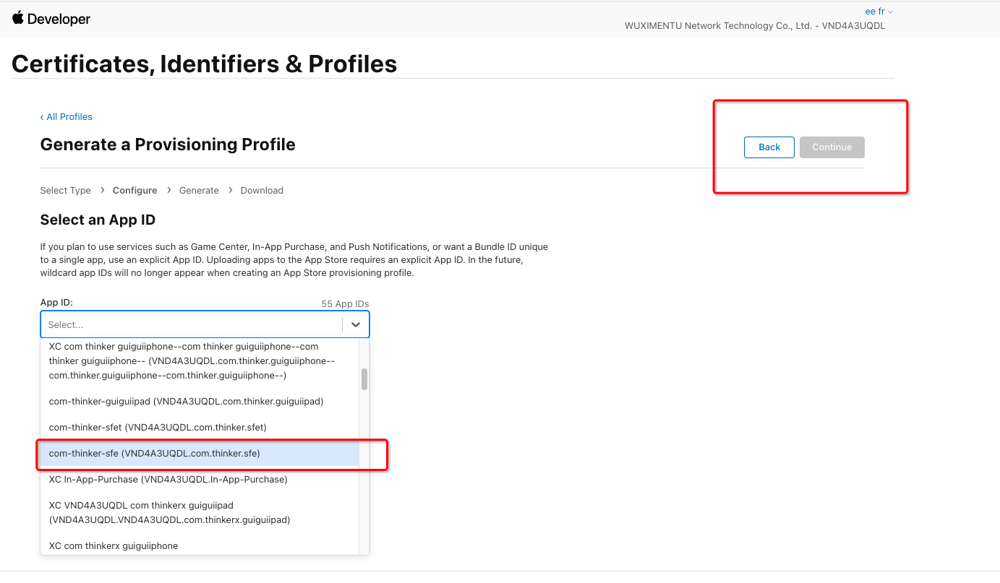
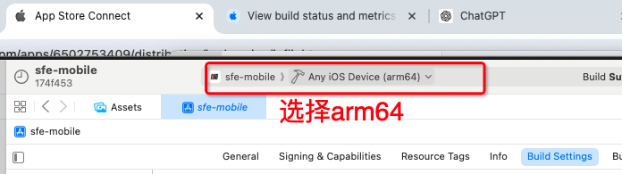
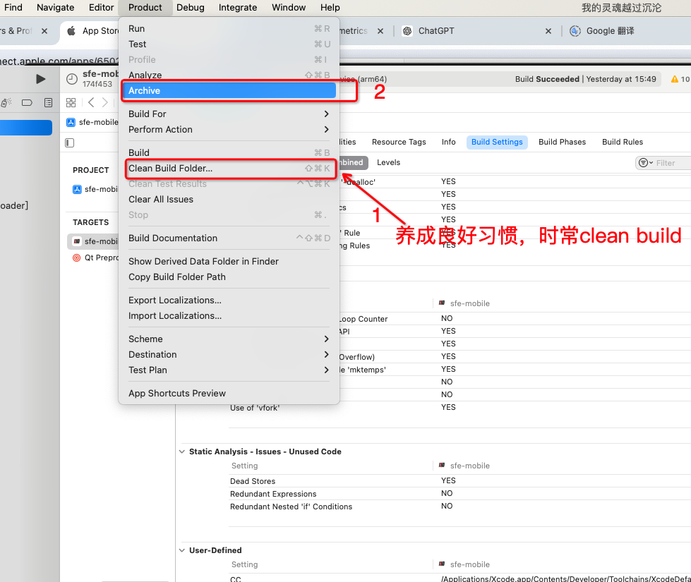
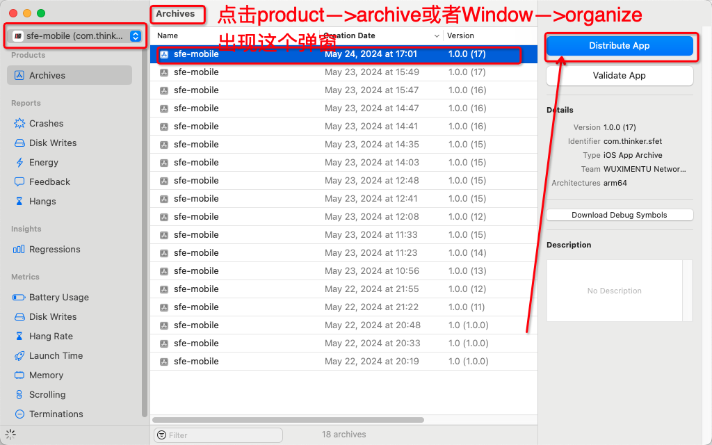
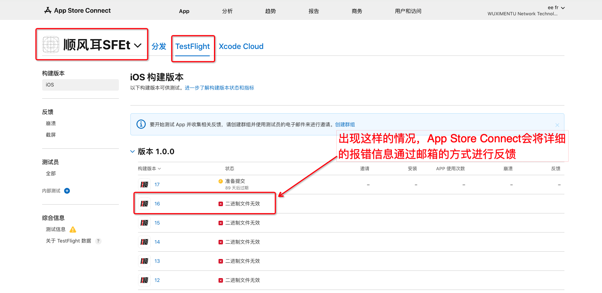
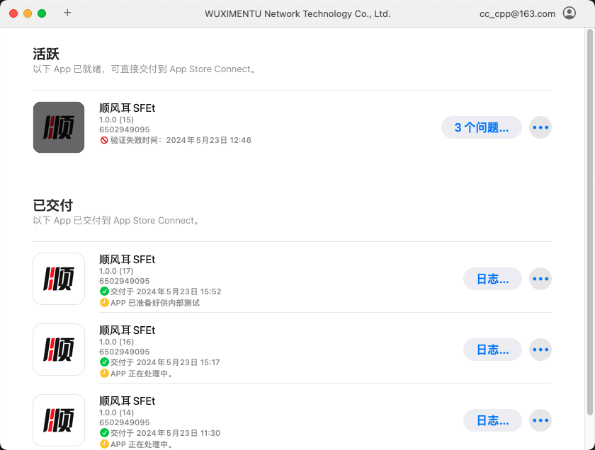

## AppStore发布应用
相关链接:

- [appstoreconnect](https://appstoreconnect.apple.com/login)

- [Apple  Developer官网](https://developer.apple.com/)

## 在Apple Developer创建一个app

### 1、Apple Developer操作
tips: 发布必须需要付费的开发者账号(与免费的开发者账号网页内容不一样)

---
在发布iOS应用到Apple  Developer平台时，处理证书是一个重要的步骤。主要涉及到两个证书：
- 证书签名请求(CSR)---此证书由我们自己从钥匙串生成
- 开发者证书(Developer Certificate)---此证书在开发者网站生成

1、在官网最下面找到`Certificates,IDs & Profiles` 或者直接点击本文链接:[Certificates,IDs & Profiles](https://developer.apple.com/account/resources/)


---

2、接下来点击Certificate+跳转到添加证书界面，因为我们需要发布 iOS应用到商城所以选择的是Software当中的`iOS Distribution (App Store Connect and Hoc)`，选择 Continue 进行下一步操作。

tips: 这个选项分为Software和Services两大类，为单选按钮


---

3、制作证书--使用‘钥匙串访问’app

成功之后会有CertificateSigningRequest.certSigningRequest文件




回到developer Apple官方添加证书

之后再将上传上的证书下载下来，下载下来之后双击安装，可以回钥匙串查找


---

4、添加 Identifiers

以下操作完成之后，点击Continue之后再Register


---

5、添加 Profiles


这里的 App ID 需要选择上面的Identifiers



---
### 2、关于App Store Connect的操作

App Store Connect是用于进行app审核

 

 

 

 

 ### 3、关于Xcode的配置操作

Tips: 这里需要qt打包正式服，并且选择iOS真机(arm架构)进行release构建。这里我release构建的时候出现了报qt的iOS源码错误，主要描述的是在import导入的时候JSON出错，我尝试将其注释之后编译通过，再将qt源码恢复，再进行重新编译，生成了build...release目录。

 - 在build...release目录下找到sfe-mobile.xcodeproj打开Xcode

 - 在Xcode当中需要在Setting的Accounts当中配置正确的Apple IDs

 - 我们的应用是不自动包含icon的，需要手动添加（现在SFE已将icon和启动动画文件集成到项目当中了，可以查看另外一个文件）









这里就会自动进行上传到App Store Connect之上，如果在这个节目没有成功上传，那么将会是明显的报错信息，去对应修改 target-->appname-->Info即可。

有一个麻烦情况是，上传成功，在App Store Connect上报错二进制错误




正常上传成功之后构建版本的状态会显示：缺乏出口合规证明


### 关于上传到 App Store Connect的另外两种方式

- Tips：上传都需要将项目进行archive，archive得到appName-time.xcarchive
- Tips：改文件路径为Library/Developer/Xcode/Archives/Time

#### 1、使用命令

```bash
xcodebuild -exportArchive -archivePath xcarchive文件路径  -exportPath 输出路径 -exportOptionsPlist ExportOptions.plist文件路径
```

其中ExportOptions.plist中destination字段若为export则表示输出ipa文件，为upload则表示上传到method对应的字段，这里使用命令进行上传到App Store Connect，使用upload
```bash
<?xml version="1.0" encoding="UTF-8"?>
<!DOCTYPE plist PUBLIC "-//Apple//DTD PLIST 1.0//EN" "http://www.apple.com/DTDs/PropertyList-1.0.dtd">
<plist version="1.0">
<dict>
        <key>destination</key>
        <string>export</string>
        <key>generateAppStoreInformation</key>
        <false/>
        <key>manageAppVersionAndBuildNumber</key>
        <true/>
        <key>method</key>
        <string>app-store-connect</string>
        <key>signingStyle</key>
        <string>automatic</string>
        <key>stripSwiftSymbols</key>
        <true/>
        <key>teamID</key>
        <string>VND4A3UQDL</string>
        <key>testFlightInternalTestingOnly</key>
        <false/>
        <key>uploadSymbols</key>
        <true/>
</dict>
```

#### 2、使用 Transporter app

```bash
xcodebuild -exportArchive -archivePath xcarchive文件路径  -exportPath 输出路径 -exportOptionsPlist ExportOptions.plist文件路径
```

其中ExportOptions.plist文件当中destination字段为export

将会在exportPath路径下生成.ipa文件

如果想查看这个文件的内容，可以将其复制一份成为zip文件，对其zip文件进行解压缩

```bash
cp appName.ipa appName.zip
unzip appName.zip
```
将得到的这个.ipa文件拖拽进入Transporter当中
