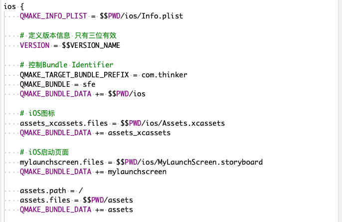
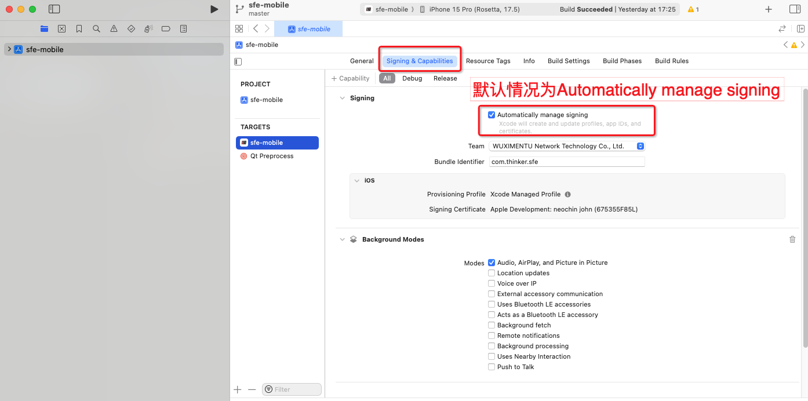

## 将资源集成到qt项目
 - 目的：避免重复每次构建上架都重新设置(icon、启动页面、bundle ID)

 - 所涉及资源：iOS图标、自制iOS启动页面、项目资源(图片)

 - 涉及参数：Bundle ID

如果Qt端配置无误，此时在Qt Creator之后在Xcode打开对应项目进行发布将不需要手动设置其他资源减少繁复操作，唯一要处理的仅为`Signing & Capabilities`的自动/手动(非必要)

## 准备icon、启动页面文件

 - 工具：Xcode

 - icon：准备icon的资源文件，将准备好的Asset.appiconset文件放入项目当中
 
 - 启动页面：在Xcode当中创建Storyboard资源(SFE是在Xcode当中修改默认的LaunchScreen文件，再将其拿出来放入Qt项目当中，设置启动的时候调用Qt的这个修改后的Stroyboard文件)

